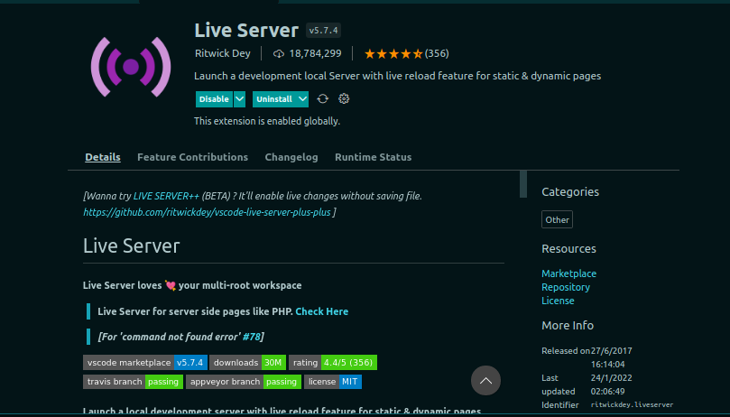

# Como hacer apuntes para la clase de desarrollo web

## Renderizar archivos de tareas

### Usando link externo

- agregar readme.md a cada actividad o tarea asignada. Esto genera una preview en github

- si el elemento a renderizar es un html se necesita generar un link para previsualizarlo 
[generar links de preview](https://htmlpreview.github.io/)

### usando github pages

1) crear una rama llamada gh-pages
2) git push -u origin gh-pages # Push the new branch back to github

3) Go to http://username.github.io/repo

Este metodo es para un projecto ya estructurado en gitSS

### Creando nuevos apuntes
1) para hacer las notas se usa vs code que permite ver una preview de markdown

2) en caso de generar el html se usa la extension liveServer

