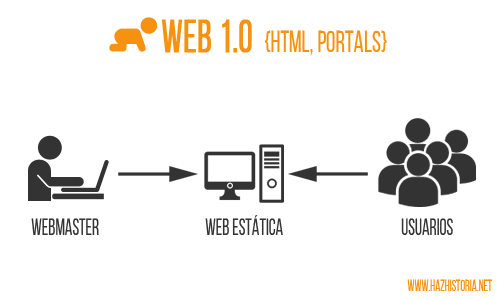
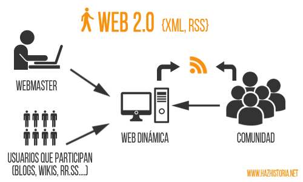
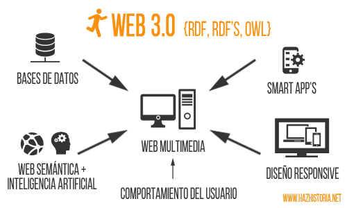
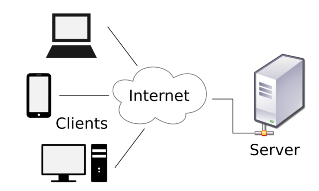
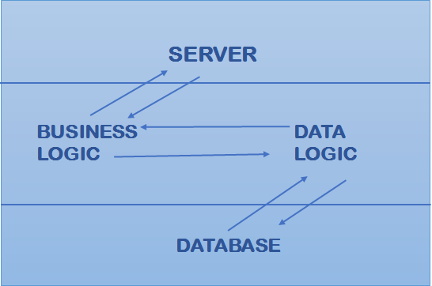
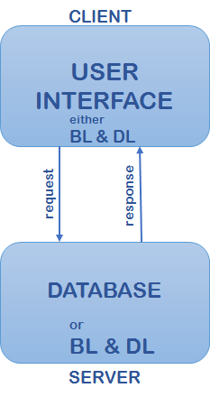
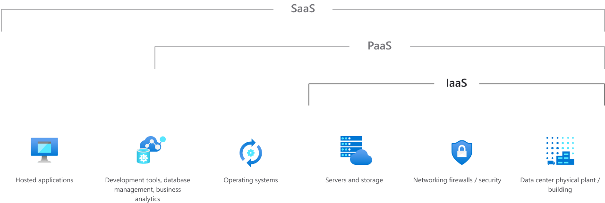

    
 

 <h1>Universidad Nacional Autónoma de México </h1> 

 <h2>Facultad de Estudios Superiores Acatlán </h2> 

 <h2>Licenciatura en Matemáticas Aplicadas y Computacion</h2> 

 
  

 <h3>desarrollo web</h3> 

  

 <h3>Nesor Eithan Castillo Hernandez</h3> 

 
     
 
# Fundamentos de desarrollo web
 
Instrucciones: Investigar y dar una conclusión de cada uno de los siguientes
puntos
1. ¿Qué es la Web 1.0 y la Web 2.0?
2. Arquitectura Cliente servidor ¿cómo funciona?
3. ¿Qué es la nube?
4. ¿Qué es IaaS? De un ejemplo;
5. ¿Qué es PaaS? De un ejemplo;
6. ¿Qué es SaaS? De un ejemplo;
7. ¿Qué es una aplicación web?
8. ¿Qué tecnología se utiliza en las aplicaciones web?
9. ¿Cuáles son las 5 tecnologías más utilizadas?
10. ¿Qué es AWS, Google Cloud y Azure? Realice un cuadro comparativo.
 
     
 
# 1. ¿Qué es la Web 1.0 y la Web 2.0?
 
## web 1.0
La versión 1.0 de la web es la forma más básica de mostrar información en los navegadores a base de solo texto. Podemos definir al usuario de esta web como un sujeto pasivo que solo recibe información o la pública, sin interacción con la interfaz de la página.
 
Otras características que podemos destacar es que tiene estilos de diseño primitivos, es una arquitectura centralizada, de solo lectura y es no interactiva con los usuarios. servía para utilizar el correo electrónico, navegadores, motores de búsqueda , etc.
 
Un punto histórico para referenciar a la web 1.0 puede ser la fiebre de las punto com.
 
- se utilizaban los framesets o marcos
- tags blink y marquee durante la guerra  de navegadores
- las páginas muy pocas veces se actualizan
 

## web 2.0
La segunda generación de la web se caracteriza por ser basada en comunidades de usuarios y la introducción de una gama de servicios, como redes sociales, blogs, wikis, chats, foros, álbumes de fotografías, presentaciones, etc. Estas nuevas formas de comunicación fomentan el intercambio de información entre usuarios de una comunidad o red.
 
más características podrían ser que se considera dinámica, interactiva con los usuarios, permite la lectura y escritura de la información y favorece a el trabajo colaborativo
 
La web 2.0 está orientada a la interacción de redes sociales, dando la oportunidad de proporcionar contenido, creando webs interactivas y visualmente dinámicas.
 
 

 
## web 3.0
La web 3.0 es conocida como la web semántica por que utiliza la forma más eficiente de los datos: 'data web'. Es inter-operativa () y el usuario tiene el control para hacer cambios que desee modificando directamente la base de datos.
 
 
la web semántica incluye metadatos semánticos y ontológicos (agregan contextos y relaciones entre datos) para que sea posible rastrearlos por sistemas de procesamiento
 
Mientras la web 2.0 está gestionada por el propio usuario humano, la web 3.0 está gestionada por la nube y ejecutada desde cualquier dispositivo con alto grado de complejidad y personalización. Por esta razón la web 3.0 está muy asociada al concepto de la personalización.
 
 
la web 3.0 tendrá toda su potencia cuando exista la tecnología que permita ofrecer nuevas opciones de personalización y búsquedas a través de la red más natural con un menor tiempo, sin embargo esto significa el inicio de la web 4.0
 
 

 
## web 4.0
 
El próximo paso de la web será la web 4.0 y se centrará en ofrecer un comportamiento más inteligente, más predictivo, dando pie a la oportunidad de que con solo una petición podamos ejecutar un conjunto de acciones que tendrá como resultado lo que pedimos.
 
los asistentes de voz han dado un gran avance entendiendo de forma más precisa y correcta lo que les solicitamos.
 
se fundamenta en 4 principales pilares:
- compresión del lenguaje natural
- Nuevos modelos de comunicación máquina-máquina M2M. la red está formada por agentes inteligentes en la nube y serán capaces de comunicarse entre sí
- uso de información del contexto
- nuevo modelo de interacción con el usuario
 
 
### Resumen y opinión
web 1.0. Fue el inicio y con funcionalidad muy limitada, los principales usuarios eran expertos informáticos y mejora con la aparición de html. no había interacción, se asemejaba a un libro donde podrás buscar y leer información
 
web 2.0 después de la crisis de las punto com en el 2001 hubo un cambio basados en tres principios básicos
- web como plataforma
- inteligencia colectiva
- arquitectura de participación
 
empezaron a aparecer los primeros blogs, wikis, redes sociales, etc
 
Web 3.0 surge en el 2006 e integra la arquitectura semántica lo que permite que la información pueda ser encontrada más rápido y eficiente.
también se relaciona con una visión en tres dimensiones de la web, abriendo nuevas formas de comunicación y colaboración usando espacios tridimensionales.
 
web 4.0 en esta etapa la inteligencia artificial aparece como principal tecnología haciendo sitios más inteligentes y capaces de interactuar y responder a necesidades de usuarios
 
 
 
     
 
# 2. Arquitectura Cliente servidor ¿cómo funciona?
Es una arquitectura de red de aplicaciones que separa las tareas entre los clientes y los servidores que viven en el mismo sistema informático o tienen que comunicarse a través de la red.
El servidor-cliente se basa principalmente en enviar la solicitud a otro programa para acceder al servicio que el servidor brinda.
 
la comunicación cliente-servidor se adhiere al conjunto de protocolos TCP/IP
 
El protocolo TCP mantiene la conexión hasta que un cliente-servidor ha completado su intercambio de información. Este protocolo decide el mejor método para distribuir los datos de la aplicación en paquete.
 
En términos simples un cliente es aquel que solicita algo y un servidor es el que lo atiende brindando su presencia en una base de datos
 

## Tipos de arquitecturas
 
### Arquitectura de nivel 1
Se encuentran en el mismo sistema todas las configuraciones del cliente o servidor, la interfaz gráfica, la lógica de datos y la lógica de marketing.
 
algunas aplicaciones administran 3 niveles como un reproductor mp3, sin embargo, esas aplicaciones se elaboran en un sistema de arquitectura de 1 nivel
 
 

### Arquitectura de nivel 2
En esta arquitectura la interfaz de usuario se almacena en la máquina del cliente y la base de datos en un servidor. La lógica empresarial y la lógica de base de datos se archivan en el servidor o en el cliente pero requiere mantenerse en buen estado.
 
Una aplicación de reserva de boletos en línea utiliza esta arquitectura de dos niveles, donde el cliente proporciona alguna entrada a un servidor donde no debe de haber ningún intermediario, se tienen que realizar la obtención de resultados rápidos y evitar confusiones entre los clientes.
 
  

 
### Arquitectura de nivel 3
La arquitectura de tres niveles se puede dividir en tres partes>
- la capa de presentación: (nivel de cliente)
- capa de aplicación (nivel empresarial)
- capa de base de datos (nivel de datos)
 
El sistema cliente maneja el cliente, el servidor de aplicaciones se ocupa de la capa de aplicación y el sistema de servidor supervisa la capa de la base de datos.

 

### Arquitectura de nivel N
La arquitectura N-tier o arquitectura de varios niveles tiene como característica que todas las presentaciones, el procesamiento de aplicaciones e incluso las funciones de administración de datos están aisladas entre sí.
 
  

 
## Ventajas y desventajas
 
### ventajas
- La rentabilidad necesita menos costes de mantenimiento y la recuperación de datos es posible.
- La capacidad de los clientes / servidores se cambiará por separado.
- Sistema centralizado con datos en un solo lugar.
 
### desventajas
- Los clientes pueden ser propensos a virus, gusanos y troyanos si están presentes en un servidor / cargados en el servidor.
- El servidor puede ser propenso a ataques de denegación de servicio.
- Los paquetes de datos se modificarán o falsificaron durante la transmisión.
- El phishing y la captura de credenciales de inicio de sesión y otra información útil del usuario son bastante comunes y el ataque Man in a Middle será común.
 
## Ejemplos de cliente servidor
- Servidores de correo: Los servidores de correo electrónico se pueden utilizar para enviar y recibir correos electrónicos. Un software diferente permite el manejo del correo electrónico.
 
- Servidores de archivos: Son la ubicación centralizada de los archivos. Por ejemplo, se accederá a los servicios en la nube para Microsoft Office y Google docs desde sus dispositivos, y se accederá a los archivos que guarde desde la computadora o desde su teléfono. De esta forma, los almacenes de archivos estarán centralizados y accederán a ellos múltiples clientes.
 
- Servidores web: Estos servidores albergarán diferentes sitios web y estos son equipos de alto rendimiento donde se alojan los sitios web. El cliente está utilizando y el servidor web es un sistema de servidor que aloja estos sitios web. El usuario o cliente solicita recursos o datos del sitio del servidor a través de Internet de alta velocidad.
 
 
     
 
# 3. ¿Qué es la nube?
Es un término que se utiliza para describir una red mundial de servidores, cada uno con una función única. La nube no es un objeto o entidad física, sino un red de servidores remotos alrededor del mundo que están conectados para funcionar como un único ecosistema.
 
Estos servidores están diseñados para almacenar y administrar datos, ejecutar aplicaciones o entregar contenido o servicios, como streaming de videos, correo web, softwares o medios sociales.
 
En lugar de acceder a archivos desde un equipo personal o local, se accede a ellos en línea desde cualquier dispositivo conectado a internet.
 
     
 
# ¿Qué es IaaS?
Infrastructure as a service
La infraestructura como servicio es un tipo de servicio en la nube que ofrece recursos esenciales de procesamiento, almacenamiento y redes a petición que son de pago por uso.
 
la migración de la infraestructura a una solución de IaaS ayuda a reducir el mantenimiento de los centros de datos locales, a ahorrar dinero en los costos de hardware y a obtener información en tiempo real
 
## ejemplos con IaaS
- Migración mediante lift-and-shift
- Desarrollo y pruebas
- Almacenamiento, copias de seguridad y recuperación
- Aplicaciones web
- Informática de alto rendimiento
 
los ejemplos más utilizados de plataformas IaaS son amazon web services y microsoft azure
 
## ventajas de IaaS
- reducir los gastos de capital y optimizar los costos
- aumenta la escala y rendimiento de las cargas de trabajo de TI
- aumenta la estabilidad, confianza y la compatibilidad
- mejora la seguridad
- Ayuda a innovar y a entregar las nuevas aplicaciones a los usuarios en menos tiempo
- se pueden crear nubes privadas, públicas e híbridas
- servidores dedicados
 
 
     
 
 
# ¿Qué es PaaS?
Ofrece plataformas como servicios. En estas plataformas se pueden lanzar aplicaciones como base de datos, middleware, herramientas de desarrollo,etc.
 
Es ideal para los desarrolladores que solo quieran centrarse en la implementación y administración de sus aplicaciones. al no tener que preocuparse por los recursos de hardware y software, mejoran su eficacia.
 
Una plataforma es un software que permite desarrollar aplicaciones
 
## ejemplos de PaaS
 
Google App Engine y Bungee Connect son dos ejemplos de plataformas como servicios. google app engine está enfocado a que el cliente pueda publicar aplicaciones web online sin tener que preocuparse por la infraestructura.
 
## ventajas de PaaS
 
 
     
 
# ¿Qué es SaaS?
Este modelo de software como infraestructura aloja el software de la empresa, así como sus datos en servidores externos y paga una cuota por su utilización. Cualquier empleado podrá acceder desde cualquier lugar a las aplicaciones de la empresa sin necesidad de instalarlas en el equipo local. cuando hablamos de software en la nube estamos hablando de SaaS
 
## ejemplos de SaaS
microsoft office 365 y CMS para diseño de paginas web como wordpress son ejemplos de software como servicio.
 
Microsoft Office 365: con esta plataforma de Microsoft los usuarios pueden acceder a las herramientas de ofimática de Microsoft (Word, Excel, Access, PowerPoint, etc.) desde cualquier dispositivo, que se ejecutan en servidores de Microsoft. El usuario sólo se preocupa de utilizar la aplicación sin tener nada que ver con su instalación, mantenimiento y actualización.
 
# Diferencias entre IaaS, PaaS y SaaS
La diferencia fundamental entre estos tres tipos de plataformas viene dada por el tipo de mantenimiento y soporte que ofrece el proveedor del servicio. Por ejemplo, en una plataforma IaaS el usuario tiene acceso al software instalado y su configuración, cosa que los usuarios de un servicio Saas no tienen. En cambio un servicio PaaS sólo tiene acceso al software que forme la plataforma de desarrollo a utilizar.
 
En cuanto a seguridad también hay diferencias notables. En un entorno IaaS la seguridad de las aplicaciones instaladas recae en el usuario que debe estar atento a qué versión instalar y a que la misma permanezca actualizada. Sin embargo, en un entorno IaaS o PaaS, la seguridad de las aplicaciones instaladas recae en el proveedor del servicio, que se encarga de su instalación y actualización.
 
  

# acrónimos
 
- IaaS: Infraestructure as a Service, en español infraestructura como servicio.
- PaaS: Platform as a Service, en español plataforma como servicio.
- SaaS: Software as a Service, en español software como servicio.
- AWS: Amazon Web Services, en español servicios web de Amazon.
- Cloud Computing: computación en nube. Servicios de software y de hardware proporcionados por terceros a través de internet.
- Middleware: software de capas que permite comunicar una aplicación con otras aplicaciones, redes o hardware.
- CMS: Content Management System, se trata de un sistema de gestión de contenidos para diseño de páginas web.
 
 
     
 
# ¿Qué es una aplicación web?
una aplicación web es un programa de aplicación que se almacena en un servidor remoto y se entrega a través de la interfaz de navegador
 
## Diferencia entre página web y aplicación web
página web es una plataforma que contiene información electrónica estática, mientras que aplicación web es un conjunto de páginas dinámicas cuyo contenido se determina después que un usuario haya interactuado con ella
 
 
     
 
 
# ¿Qué tecnología se utiliza en las aplicaciones web?
Existen numerosas tecnologías web, algo que si bien es una ventaja en el diseño y desarrollo de sitio web, puede llegar a complicar la elección o la toma de decisión de cuál utilizar y para qué.
 
 
     
 
# ¿Cuáles son las 5 tecnologías más utilizadas?
## Tecnologias front end
- javascript
Al usar este lenguaje de programación multiplataforma, es posible dar una mayor interactividad y dinamismo a los sitios web. Y esto es así porque permite crear tanto animaciones como objetos, localizar errores en formularios, cambiar elementos web de manera intuitiva y crear cookies, etc. Además, también permite desarrollar aplicaciones tan potentes como Facebook o Twitter.
 
- HTML
HTML sirve para describir el contenido de un sitio web, como la información estructurada de párrafos, imágenes, etc. Por eso, HTML es una de las tecnologías web indispensables para cualquier desarrollador.
 
- CSS
Es una de las tecnologías web a la que más recurren los programadores gráficos a la hora de desarrollar sus proyectos. Es un lenguaje de diseño gráfico que sirve, entre otras muchas funciones, para indicar la representación visual de las estructuras HTML
 
 
 
## Tecnologias back end
 
- PHP
La característica principal de PHP es que se usa para la comunicación de tu sitio web con un servidor de datos.
 
- PYTHON
a pesar de su sencillez, es bastante potente, ya que usa menos líneas de código que cualquier otro lenguaje de programación para cualquier aplicación que se ejecute
 
-JAVA EE
El Java Enterprise Edition, también conocido como Jakarta EE, es un grupo de tecnologías que se dedica al desarrollo de Java del lado del servidor. Se orienta, en concreto, a objetos de alto nivel, es decir, al desarrollo de aplicaciones empresariales, pero a gran escala
 
     
 
 
# ¿Qué es AWS, Google Cloud y Azure? Realice un cuadro comparativo.
 
 
| AWS                                                                                                                                                                                                                                                                                 | Google Cloud                                                                                                                                                                                                                                                                                                                                                                               | Azure                                                                                                                                                                                                   |
|-------------------------------------------------------------------------------------------------------------------------------------------------------------------------------------------------------------------------------------------------------------------------------------|--------------------------------------------------------------------------------------------------------------------------------------------------------------------------------------------------------------------------------------------------------------------------------------------------------------------------------------------------------------------------------------------|---------------------------------------------------------------------------------------------------------------------------------------------------------------------------------------------------------|
| Te aporta flexibilidad: AWS permite seleccionar el sistema operativo, el lenguaje de programación, la plataforma de aplicaciones web, la base de datos u otros servicios que necesites. Esta flexibilidad permite que puedas centrarte en la innovación y no en la infraestructura. | Red de Fibra Global Privada + Red Gradual: Su red es una de las más grandes del mundo. Para que te hagas una idea, en 2018 anunció que estaba poniendo sus propios cables de fibra óptica bajo el Océano Pacífico.                                                                                                                                                                         | Reducción de costes: El capital destinado para hardware lo ahorras trabajando en cloud.                                                                                                                 |
| Mayor rentabilidad: AWS ofrece precios bajos por uso, sin gastos anticipados ni compromisos a largo plazo. Únicamente tienes que afrontar el costo de la potencia de cómputo, el almacenamiento y demás tipos de recursos que vayas a utilizar.                                     | Migración en vivo de máquinas virtuales: Esto significa que las máquinas virtuales siempre están activas sin degradación notable en el rendimiento cuando están migrando en vivo máquinas virtuales entre máquinas host. Las migraciones en vivo permiten a los ingenieros de Google abordar mejor los problemas como el parcheo, la reparación y la actualización de software y hardware. | Mayor Seguridad: Microsoft te garantiza que tus datos siempre van a estar seguros, redundados y con una SALA del 99,9% de disponibilidad.                                                                |
| Incrementa la velocidad: Gracias AWS se puede reducir el tiempo en lo que tardan los recursos en estar disponibles para los desarrolladores, pudiendo pasar de semanas a minutos.                                                                                                   | Mejor rendimiento: Las máquinas de Google Cloud manejan fácilmente más de 60k visitantes concurrentes sin ningún contratiempo.                                                                                                                                                                                                                                                             | Uso operativo: Su flexibilidad permite compartir la misma plataforma que utiliza Skype, Office 365, Bing y Xbox, ofreciendo soporte técnico continuo y una supervisión puntual del estado del servicio. |
| Mayor seguridad: Cuenta con certificaciones y acreditaciones para administrar la infraestructura de TI de las empresas de manera segura y duradera.                                                                                                                                 | Seguridad: Datos codificados en tránsito entre Google, los clientes y los centros de datos, autenticación y autorización de las solicitudes procedentes de otros componentes, menos saltos a través del Internet Público, realización de auditorías regulares, etc.                                                                                                                       | Flexible: Azure admite cualquier sistema operativo, lenguaje, herramienta y marco, permitiendo crear aplicaciones y servicios que puedan funcionar con cualquier dispositivo.                           |
| Plataforma escalable: Gracias a herramientas como AWS, Auto Scaling y Elastic Load Balancing, se tiene acceso a los recursos informáticos y de almacenamiento siempre que sea necesario.                                                                                            | Respaldos de Seguridad Redundantes: El almacenamiento de Google Cloud Hosting (GC Storage) está diseñado para una durabilidad de 99.999% y cuenta con 4 tipos diferentes de almacenamiento.                                                                                                                                                                                                | Almacenamiento en la nube: Azure te ofrece la opción de alojamiento en espacios virtualizados, permitiéndote adquirir la capacidad necesaria bajo un esquema flexible y práctico.                       |
 
 
 
## ¿Cuál escoger?
Claro está que las tres compañías brindan servicios similares pero la elección depende de la necesidad y del capital del cliente. Los servicios de aws tienen un control de rendimiento que nos permite controlar nuestros gastos en relación a nuestra capital, en cambio google brinda un límite gratuito y de pruebas en varios de sus productos. Ambas cuentan con servicios donde podremos conectarnos y hacer un ecosistema de tecnologías relacionadas a la compañía de nuestra elección. por otro lado microsoft es el rey en sus clientes y servidores windows, la migración de máquinas virtuales y uso de servicios se ven beneficiados con clientes de su misma comunidad.
 
 
 
 # comentario
 no hacer tareas en Markdown, es muy tardado y se pierde mucho estilo. por otro lado se puede guardar en el "segundo cerebro" que funciona con archivos markdown
 
 
 
## bibliografía
Antoniony, B. (2022). Definición de IaaS, PaaS y SaaS ¿En qué se diferencian? Brismark Antoniony. Recuperado 21 de marzo de 2022, de https://www.ambit-bst.com/blog/definici%C3%B3n-de-iaas-paas-y-saas-en-qu%C3%A9-se-diferencian#:%7E:text=Ejemplos%20de%20PaaS,por%20la%20infraestructura%20donde%20hacerlo.

Bardají, E. (2022). Comparativa Cloud: Amazon Web Services (AWS), Microsoft Azure y Google Cloud. Eduard Bardají. https://www.esedsl.com/blog/comparativa-cloud-amazon-web-services-aws-microsoft-azure-y-google-cloud#:%7E:text=Amazon%20Web%20Services%20(AWS)%20se,geogr%C3%A1ficas%20de%20todo%20el%20mundo.

C. (2021a, marzo 22). Arquitectura cliente-servidor: definición, tipos, ejemplos, ventajas y desventajas. Aprende a Programar Gratis. https://aprendiendoaprogramar.es/blog/arquitectura-cliente-servidor-definicion-tipos-ejemplos-ventajas-y-desventajas/

Carranza, A. (2021, 27 noviembre). Aprende qué es una aplicación web y ¡crea una que logre más descargas que WhatsApp! https://www.crehana.com. https://www.crehana.com/co/blog/desarrollo-web/aplicacion-web-que-es/

colaboradores de Wikipedia. (2022, 10 febrero). Web 2.0. Wikipedia, la enciclopedia libre. https://es.wikipedia.org/wiki/Web_2.0

HostingPlus Mexico. (2020, 18 junio). Evolución de la Web a lo largo del tiempo: web 1.0, 2.0, 3.0 y 4.0 | Blog | Hosting Plus Mexico. Hosting Plus. https://www.hostingplus.mx/blog/evolucion-de-la-web-a-lo-largo-del-tiempo-web-1-0-2-0-3-0-y-4-0/#:%7E:text=Tras%20la%20web%201.0%202.0,4.0%20a%20una%20web%20predictiva

P. (2021b, junio 15). Tecnologías para el desarrollo web más actuales. proun. https://www.proun.es/blog/tecnologias-web-actuales/

Paradigma Digital. (2022, 18 enero). Web 4.0. https://www.paradigmadigital.com/dev/web-4-0/

¿Qué es IaaS? Infraestructura como servicio en la nube. (2021). Rackspace Technology. Recuperado 21 de marzo de 2022, de https://www.rackspace.com/es-mx/library/what-is-iaas#:%7E:text=Los%20ejemplos%20m%C3%A1s%20utilizados%20de,plataforma%20como%20servicio%20(PaaS).

Qué es la nube: definición. (2021). Microsoft Azure. Recuperado 21 de marzo de 2022, de https://azure.microsoft.com/es-mx/overview/what-is-the-cloud/

¿Qué es PaaS? Plataforma como servicio. (2021). Microsoft Azure. https://azure.microsoft.com/es-mx/overview/what-is-paas/

https://d1wqtxts1xzle7.cloudfront.net/59947315/74_Historia_de_la_Web20190706-123188-141xd95-with-cover-page-v2.pdf?Expires=1647558044&Signature=C3vsSQhYpyRTDnBc-SU1khrAoSbJEYwJ3Vw6vgNaEOQTqlJZr46vF34EfBcw5pAkVFrliSgNoeF~UWn7pf~r6AHk02PSv5zJ~G91LLgmMuMp~1hyxF2WNVh0SG9vqtjrmLgzk1jyvG9Gub959G0q1TXG2AjErwg4L3bHUnuQY8e4ky9X4C9STe4r5s0FuoCGXD2alGmJoCTNOMdCJ8ikOfm90i8x7vMQcv7S2TbDvIpoyl-qT~93XNmvKdmDrdAooQ4HmrVUrmPsntt8PKRc47aD95B4mmF5SHRC3KHDQxISe5w~PpAuaaI2J0iOfknot9qHVbo9jxVeZ0Hs3qSo5w__&Key-Pair-Id=APKAJLOHF5GGSLRBV4ZA
 
https://www.tablesgenerator.com/markdown_tables#

